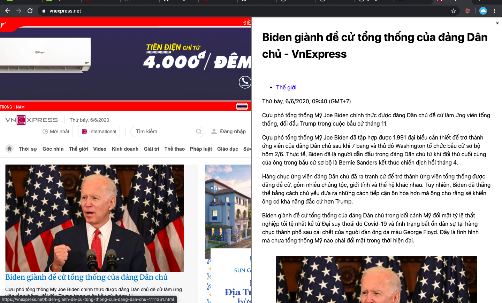

# URL-Reader

## It looks like 

## How to use

- Rigth click to URL and chose 'View URL'
- Close Reader mode by click 'x' button at the top right , or press 'ESC'

## How to install extenion

- Clone or Download this Source (if Download ZIP then UnZIP it)
- Go to Chrome -> Go: chrome://extensions/ -> Load Unpacked -> Open the Source folder
- Install success like this

## Contributing

Interested in contributing? Awesome!

Thanks!
